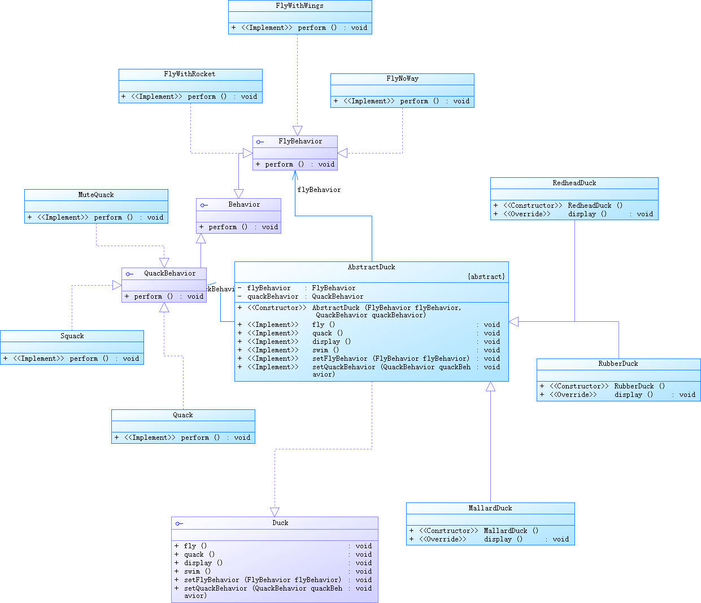
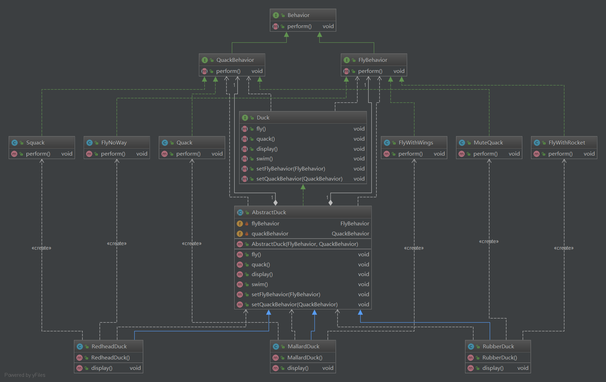

# Strategy模式
## UML类图（PowerDesigner）

## UML类图（IDEA）

## 测试
测试程序为`strategy.src.Main`
```java
public class Main {

    public static void main(String[] args) {
        Duck redheadDuck = new RedheadDuck();
        Duck mallardDuck = new MallardDuck();
        Duck rubberDuck = new RubberDuck();

        redheadDuck.display();
        mallardDuck.display();
        rubberDuck.display();
        System.out.println("========================================================");

        redheadDuck.setQuackBehavior(new Squack());
        redheadDuck.quack();
        redheadDuck.setQuackBehavior(() -> System.out.println("啦啦啦,我是一只会说话的鸭子！"));
        redheadDuck.quack();
    }

}
```
测试结果：
```text
I`m a redheadDuck.
Trying to fly:I cannot fly!!!
Trying to quack:吱吱吱
I`m a mallardDuck.
Trying to fly:拍翅膀
Trying to quack:呱呱呱
I`m a rubberDuck.
Trying to fly:喷射
Trying to quack:This duck cannot quack.
========================================================
吱吱吱
啦啦啦,我是一只会说话的鸭子！
```